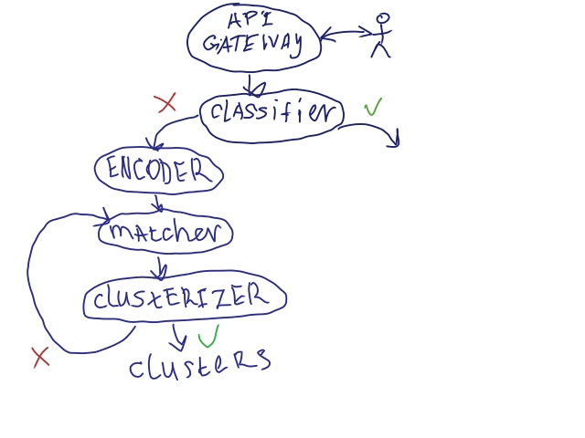
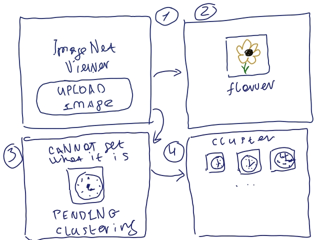

# ImageNet viewer

Some businesses get incoming flow of images which have to be handled. Moderators are trying to 
recognize a category of an image and fill some attributes (like object type, size/color of an object)
 according to some business rules.

Automation of recognition in such situation is quite interesting idea. There is need to classify 
already known objects and at the same time there should be functionality to add a new object 
category to adapt to the needs of the user.

--------------------
Idea: create admin-like web app which allows to classify and manage images, 
create new image types (classes), handle unclassified images.

**classify and manage images**: classification is done using pretrained ImageNet models which are served 
using [Triton Inference Server](https://github.com/triton-inference-server). Image management 
in this context means that user can manually edit attributes of an image, upload and delete images.

**create new image types**: allow user to create new category of images (image type) 
using a bunch of examples (tens) or create image types automatically using set of unclassified 
images.

**handle unclassified images**: collect unclassified images into groups to ease 
creating new image types (automatically of manually).

There are services-like programs that can classify images ([classifier](https://github.com/yashenkoxciv/imagenet-viewer-classifier)) 
and also collect unclassified images to groups of similar images ([encoder](https://github.com/yashenkoxciv/imagenet-viewer-encoder), [matcher](https://github.com/yashenkoxciv/imagenet-viewer-matcher), [clusterizer](https://github.com/yashenkoxciv/imagenet-viewer-clusterizer)).

Services connected like this:

Minimal UI should be similar to this:

# Ideas

# ToDos
